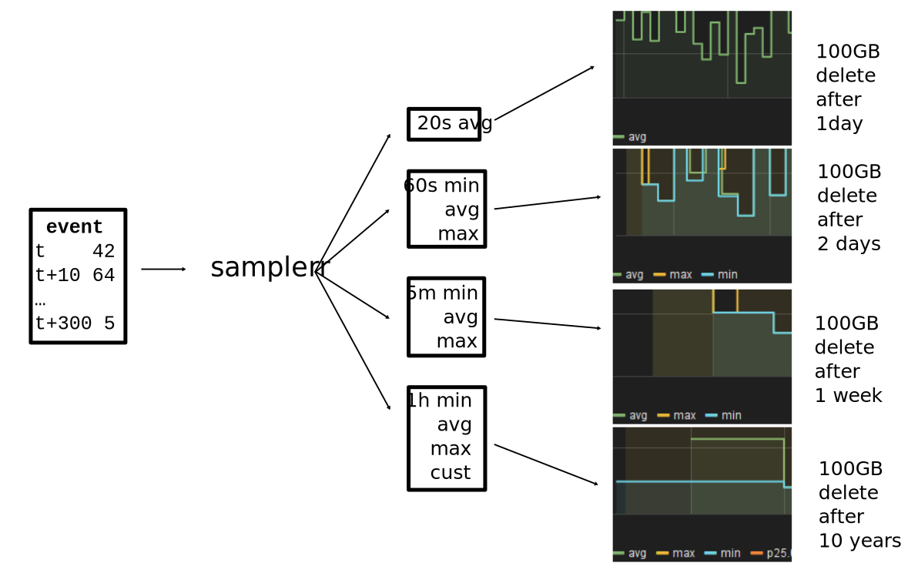

# samplerr

## Introduction

The main goal of this project is to provide a means for long term relevant storage for your metrics.
It borrows some of [rrdtool](http://rrdtool.org/)'s concepts and leverages the power of a modern storage backend: [elasticsearch](http://elastic.co/products/elasticsearch).

The idea is to downsample metrics to multiple sampling rates by consolidating those using meaningful aggregation functions: multiple archive stores with different resolutions.
Different resolution archives are mainly useful for two reasons:

1. Keep storage space in bounds
2. Keep data amount in bounds at query time

Different consolidation functions (*e.g.* min, max, avg, *etc.*) are mainly useful for keeping track of what matters in the metrics you keep.

samplerr keeps storage low and client queries fast by purging high-resolution data periodically and creates
[elasticsearch aliases](https://www.elastic.co/guide/en/elasticsearch/reference/current/indices-aliases.html) to point the clients to the highest available resolution.


## How it works



In this example, samplerr ingests a metric which has a 10s interval. It then downsamples it to 4 different archives with different consolidation functions.
It keeps different retention policies for each elasticsearch index. For instance, the highest resolution data is kept for one day, while the lowest resolution is kept for 10 years.

## Features

* multiple resolution archives
* consolidation functions
* constant round robin storage footprint per metric with respect to time
* transparent query across all archives

Its architecure is modular, so you can use any of its following main functions:

* *Downsample* metrics using consolidation functions
* *Persist* metrics to the storage backend
* *Rotate* archive references
* *Purge* expired archives

## Implementation

The current implementation:

* is a [riemann](http://riemann.io/) plugin
* writes your metrics to [elasticsearch](http://elastic.co/products/elasticsearch)
* aggregates data using arbitrary clojure functions
* aggregates data in realtime into different round robin time-based elasticsearch indices (archives)
* manages your time based elasticsearch aliases to point to highest possible resolution data
* ensures your metric stays within storage boundaries

## Installation

After cloning the repo, you can build the plugin using [leiningen](/technomancy/leiningen)

```
lein uberjar
```

This will create a plugin jar named `samplerr-x.y.z-SNAPSHOT-standalone.jar` which you can include into your *java classpath*, *e.g.*:

```
java -cp /usr/lib/riemann/riemann.jar:/usr/lib/riemann/samplerr-0.1.1-SNAPSHOT-standalone-up.jar riemann.bin start /etc/riemann/riemann.config
```

On debian or redhat you could also add the classpath using the `EXTRA_CLASSPATH` variable available respectively in `/etc/default/riemann` or `/etc/sysconfig/riemann`.

## Synopsis

```clojure
(load-plugins)
(require '[clj-time.core :as t])

(let [elastic      (samplerr/connect "http://localhost:9200")
      index-prefix ".samplerr"
      alias-prefix "samplerr"
      cfunc        [{:func samplerr/average :name "avg"}
                    {:func samplerr/minimum :name "min"}
                    {:func samplerr/maximum :name "max"}]
      archives     [{:tf "YYYY.MM.dd" :step (t/seconds 20) :ttl   (t/days 2) :cfunc cfunc}
                    {:tf "YYYY.MM"    :step (t/minutes 10) :ttl (t/months 2) :cfunc cfunc}
                    {:tf "YYYY"       :step    (t/hours 1) :ttl (t/years 10) :cfunc cfunc}]
      rotate       (samplerr/periodically-rotate {:interval (t/days 1) :conn elastic :index-prefix index-prefix :alias-prefix alias-prefix :archives archives)
      persist      (batch 1000 10 (samplerr/persist {:index-prefix index-prefix :index-type "samplerr" :conn elastic}))]

  (streams
    (where (tagged "collectd")
      (by [:host :service]
       (samplerr/down archives persist))))
  rotate)
```

## Usage

`samplerr` provides five high-level functions, two of which are stream functions.

### Stream functions

#### `(down archives & children)`

This stream function splits streams by archive and consolidation functions.
It conveniently passes on events to child streams, for example to send those to elasticsearch using the `persist` stream function.

The sequence `archives` should contain at least one archive. Each archive describes the aggregation that shall be performed and the target archive:

```clojure
(def archives [{:tf "YYYY.MM.dd" :step   20 :cfunc cfunc}
               {:tf "YYYY.MM"    :step  600 :cfunc cfunc}
               {:tf "YYYY"       :step 3600 :cfunc cfunc}])
```

* `:tf` time format string to be used to target the archive. This will be used by `persist` to target the corresponding elasticsearch index. This will be parsed by `clj-time.format` and must thus be valid. Example: the event `{:time 1458207113000 :metric 42}` will be indexed to elasticsearch into `.samplerr-2016.03.17`, `.samplerr-2016.03` and `.samplerr-2016` concurrently with the above config.
* `:step` contains the consolidation time interval to be used to accumulate events to be aggregated using `cfunc`. This is the equivalent of `rrdtool`'s step, and represents the resolution of your time series.
* `:cfunc` contains the list of consolidation functions to be used.

Consolidation functions are a hash map containing two keys:

```clojure
(def cfunc [{:func samplerr/average :name avg}
            {:func samplerr/minimum :name min}
            {:func samplerr/maximum :name max}])
```

* The value of `:func` contains the stream function to be used for consolidation. It should accept one parameter corresponding to the `:step` interval. **the interface may change in the future**
* The value of `:name` will be used as an attribute to the consolidated events, and subsequently be indexed using elasticsearch. Following up on the above example: the same event stream will be indexed to 9 elasticsearch documents: one per archive and per cfunc. For instance: `{"@timestamp": "2016-03-17T10:31:53+01:00", "metric": 42, "cfunc": "avg", "_index": ".samplerr-2016.03.17"}`

`samplerr` provides some commonly used cfuncs like `average`, `minimum` and `maximum` which are described in the corresponding section.

#### `(persist options & children)`

This stream function sends events processed by `down` to the storage backend (elasticsearch). It is configured using the hash-map `options`:

```clojure
(def options {:index-prefix index-prefix :index-type index-type :conn es-conn-handle})
```

* `:index-prefix` points to the string to be prefixed to the elasticsearch index. The event's time formatted using the archive's `:tf` will be appended to that prefix.
* `:index-type` elasticsearch document type
* `:conn` connection handle to the elasticsearch REST endpoint. This can be a `clojurewerkz.elastisch.rest/connect` endpoint, or our wrapped one called `connect`

Events should contain the riemann attribute `:tf` which will route them to the appropriate archive.

### Other functions

#### `(connect)`

This is a proxy to `clojurewerkz.elastisch.rest/connect`

#### `(rotate {:conn es-conn-handle :index-prefix index-prefix :alias-prefix alias-prefix :archives archives)`

This will manage elasticsearch aliases.
Aliases will be created for each `archive` by concatenating `index-prefix` with the `:tf` formatted date and will point to the first *unexpired* index (prefix `index-prefix`). Expiry is computed using the archive's `:ttl`.
The idea behind this is that clients will query elasticsearch using the aliases. Most high-level clients (*e.g.* [grafana], [kibana]) can only point to one time-base index pattern, *e.g.* `foo-YYYY.MM.dd`.

`samplerr` will transparently position aliases pointing to the highest possible resolution archive that overlaps with it and that is not expired. The algorithm is roughly the following:

* for each index matching `<index-prefix>*`
  * is the ttl expired?
    * YES: move all its aliases to the next unexpired period
    * NO:
      * find archive it belongs to
      * parse the time of the beginning of its period using `:tf`
      * add an alias `<alias-prefix>-<parsed-time>`

The usual way to use this function is either:

* periodically using `periodically-rotate`
* triggered by an event in the stream. For instance you could trigger the rotation when the day changes

#### `(periodically-rotate {:interval periodicity :conn es-conn-handle :index-prefix index-prefix :alias-prefix alias-prefix :archives archives)`

This function will call `rotate` every `periodicity` time interval. The first argument should be given in terms of a `org.joda.time/PeriodType` object conventiently provided by `clj-time.core` using *e.g.* `hours`, `days`, *etc.*

Note that the first rotation will not take effect immediately after riemann startup.
Also note that configuration reloads will work as expected.

##### Example

Take the example in the [synopsis](#synopsis) section. Let's say today is 2016-02-01 at 03:14 PM and
riemann started exactly 2 days ago. `samplerr/rotate` fires up and processes the elasticsearch indices:

* `.samplerr-2016.02.01` is younger than two days: create alias `samplerr-2016.02.01`
* `.samplerr-2016.01.31` is younger than two days: create alias `samplerr-2016.01.31`
* `.samplerr-2016.01.30` is two days old: expired! move its aliases to `.samplerr-2016.01`
* `.sampler-2015.02` is younger than two months: create alias `sampler-2015.02`
* `.sampler-2015.01` is younger than two months: create alias `sampler-2015.01`
* `.sampler-2014.12` is two months old: expired! move its aliases to `.samplerr-2014`
* …

#### `(purge {:conn es-conn-handle :index-prefix index-prefix :archives archives)`

This function will **DELETE** expired indices. Use with care.

The usual way to use this function is either:

* periodically using `periodically-purge`
* triggered by an event in the stream. For instance you could trigger the purge when the disk space is full on the elasticsearch node

#### `(periodically-purge {:interval periodicity :conn es-conn-handle :index-prefix index-prefix :archives archives)`

This function will call `purge` periodically.

## Development

At the time of writing the contributors of this project are Fabien Wernli and some code from the elasticsearch integration was borrowed from [tnn1t1s](https://github.com/tnn1t1s/riemann-elastic) which itself borrowed from [kiries](https://github.com/threatgrid/kiries).

